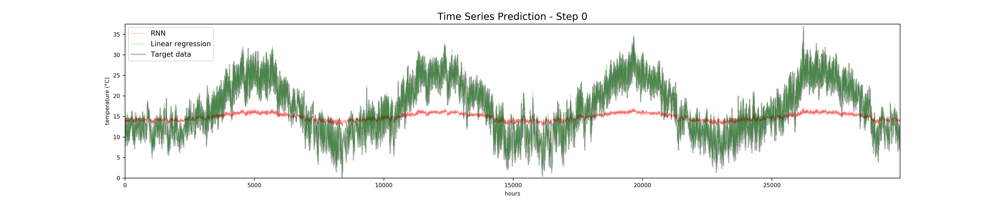
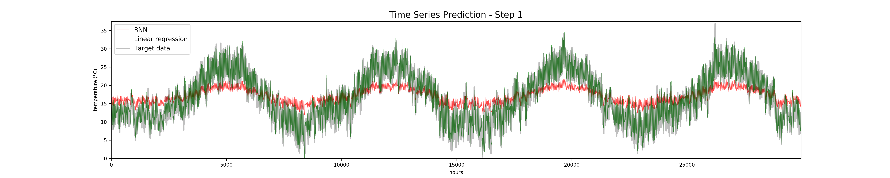

# Timeseries Forecasting with RNNs

An experiment of weather forecasting with three recurrent neural network (RNN) architectures: a basic RNN, a long short-term memory (LSTM) RNN and a gated recurrent units (GRU) RNN.

RNN prediction training steps

## Setup

### Requirements (tested versions)
matplotlib (2.2.2 to 3.1.1) 
numpy (1.14.2 to 1.17.2) 
python (3.5.2 to 3.7.4) 
scipy (1.0.1 to 1.3.1) 
torch (1.1.0) 
Can be executed in CPU mode
